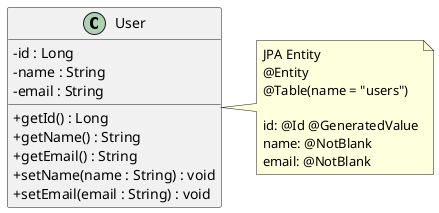
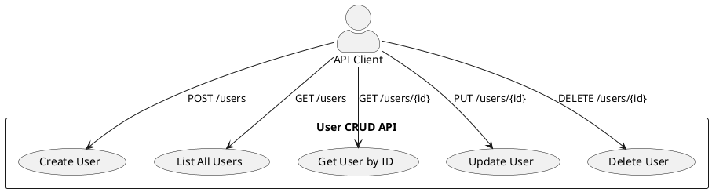
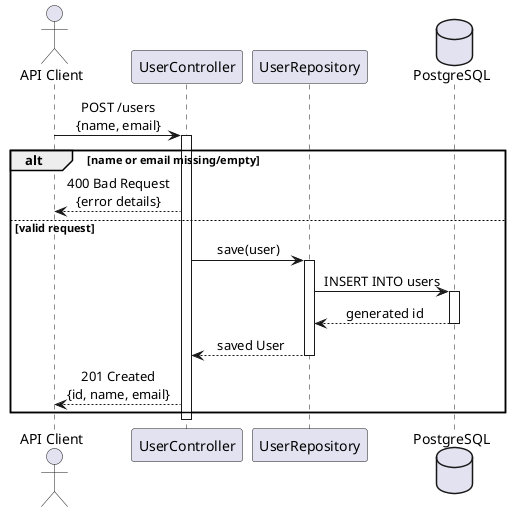
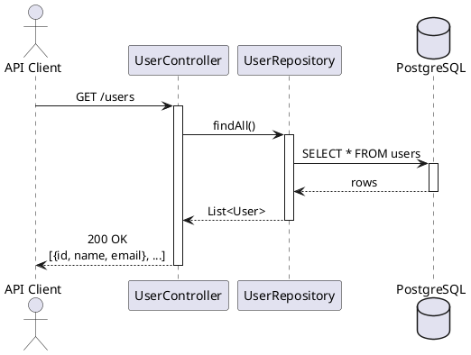
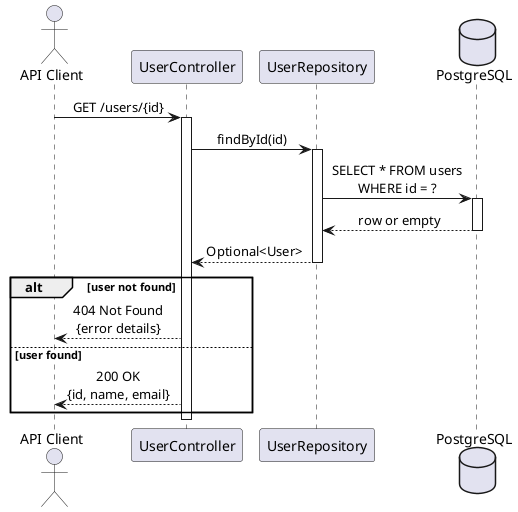
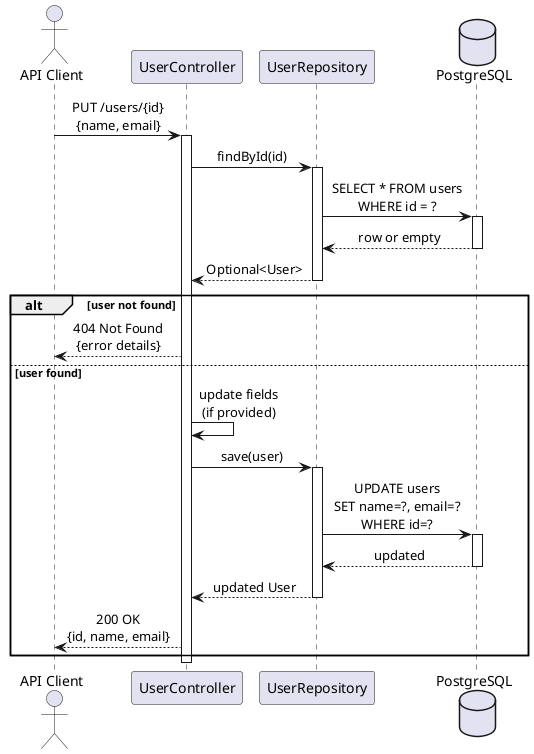
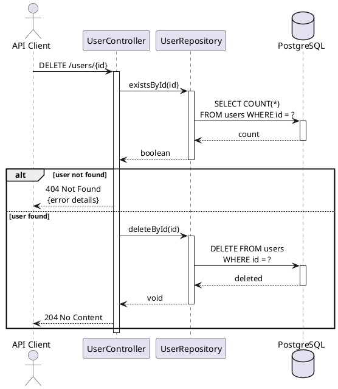

# Data Model: User CRUD API

**Date**: 2026-02-05

## Entities

### User

| Field | Type | Constraints | Description |
|-------|------|-------------|-------------|
| id | Long | Primary key, auto-generated | Unique identifier |
| name | String | Required, non-empty | User's name |
| email | String | Required, non-empty | User's email address |

**Notes**:
- No email format validation (any non-empty string accepted)
- No uniqueness constraint on email
- ID auto-generated by database (sequence/identity)

## PlantUML Diagrams

### Data Model (Class Diagram)



### Use Case Diagram



### Sequence Diagram: POST /users (Create User)



### Sequence Diagram: GET /users (List All Users)



### Sequence Diagram: GET /users/{id} (Get User by ID)



### Sequence Diagram: PUT /users/{id} (Update User)



### Sequence Diagram: DELETE /users/{id} (Delete User)



## Database Schema

```sql
CREATE TABLE users (
    id BIGSERIAL PRIMARY KEY,
    name VARCHAR(255) NOT NULL,
    email VARCHAR(255) NOT NULL
);
```

**Note**: Schema auto-generated by Hibernate (spring.jpa.hibernate.ddl-auto=update).
